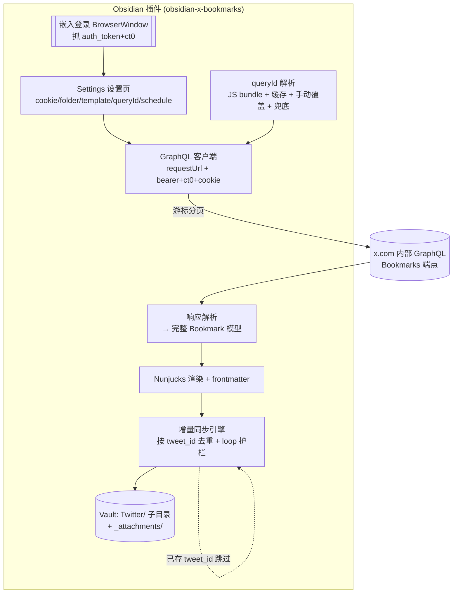
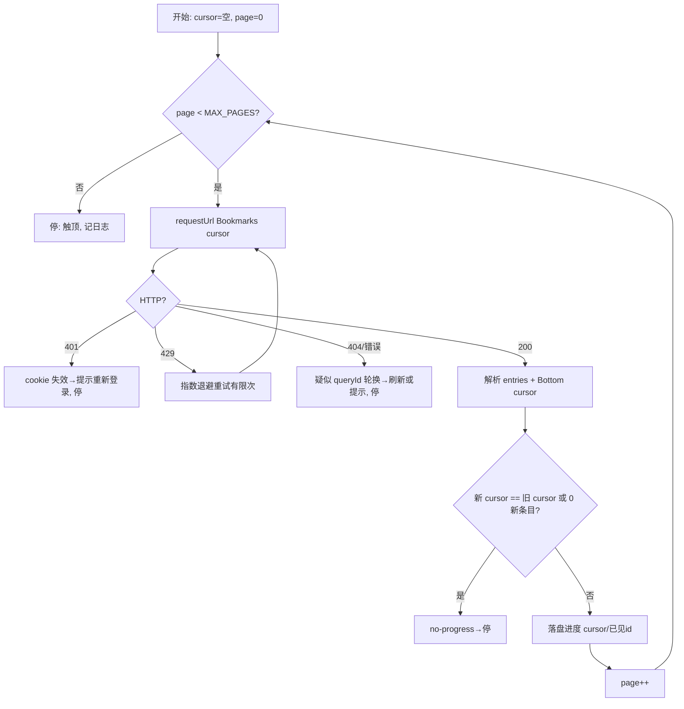

# feat: Obsidian Twitter/X 书签同步插件

> **目标仓库 = 新建独立插件仓库 `obsidian-x-bookmarks`**（尚未创建）。本计划文件存于 KenIdea 工作区 `docs/plans/`；下文所有 `src/...` 路径相对未来的插件仓库根。

## Summary

做一个 Obsidian 插件,把用户自己的 **Twitter/X 书签(bookmarks)** 拉进 vault 的 `Twitter/` 子目录,每条书签一份 Markdown,**架构对标 obsidian-weread-plugin**:嵌入式网页登录抓 cookie → 用 cookie 调 X 内部 GraphQL `Bookmarks` 端点 → 解析成完整书签模型(正文/作者/时间/永久链接/媒体/引用推文) → Nunjucks 模板渲染 → 写入 Markdown,按**不可变 tweet id 增量去重**(存过即跳过),支持手动命令 + 定时同步。**非官方 cookie 路线**(Ken 定:不用付费 X API)。

## Problem Frame

- **要解决**:Ken 想把 X 书签沉淀进 Obsidian(像 weread 笔记那样),可检索、可永久保存、可被 PersonOS 等下游消费。X 官方 API 已付费且 gated,故走非官方 cookie 路线。
- **核心约束(Ken 确认 2026-06-15)**:① 非官方、cookie-based;② **嵌入网页登录**抓 cookie(weread 式,不手动粘 cookie 为主);③ 单条书签**尽量保存完整**(含媒体、引用推文),**不做线程重建**。
- **最大技术风险**:X 内部 GraphQL 的 `queryId`/`features` 每 2–8 周轮换 → 这是头号脆弱点,计划必须正面处理(见 KTD2)。

## Requirements（可追溯）

- **R1**：嵌入式 X 登录(Electron BrowserWindow)→ 捕获 `auth_token`+`ct0` cookie → 存入插件设置;桌面端;移动端不支持登录(降级:手动粘贴 cookie)。
- **R2**：用 cookie + 静态 web bearer + `x-csrf-token=ct0` 调 X GraphQL `Bookmarks`,游标分页拉全量书签。
- **R3**：`queryId` 自动发现(解析 X JS bundle)+ 手动覆盖设置 + 静态兜底;失效时给清晰可诊断报错,而非静默失败。
- **R4**：解析为完整书签模型——正文(含 `note_tweet` 长文)、作者、`created_at`、永久链接、媒体(图/视频/GIF variants)、引用推文(递归一层)、外链 card;**不重建线程**。
- **R5**：每条书签渲染成 Markdown(Nunjucks 模板,可自定义)写入 `Twitter/` 子目录,带去重哨兵 frontmatter(`doc_type: x-bookmark` + `tweet_id`)。
- **R6**：按**不可变 tweet id 增量去重**——已存在的书签**跳过、绝不覆写**(规避 weread「计数变了覆写丢手动编辑」的坑);只新建缺失的。
- **R7（Ken 硬规则:任何 loop 必须配护栏）**：分页拉取循环必须有 max-pages / no-progress(游标不前进)检测 / 429 退避 / 进度落盘,缺一不可。
- **R8**：手动命令触发 + 可选定时同步(`registerInterval`);所有网络请求走 Obsidian `requestUrl()` 绕过 CORS。
- **R9（可选）**：媒体本地化——把图片/视频下载进 `Twitter/_attachments/`,使书签在原推删除后仍完整(设置开关)。

---

## Key Technical Decisions

- **KTD1 — 非官方 cookie 路线 + 嵌入 BrowserWindow 登录**（Ken 定）。复刻 weread 的 `require('electron').remote` → `new BrowserWindow` 打开 `https://x.com/i/flow/login`,监听 `did-navigate` 到 `x.com/home`,`session.cookies.get({domain:'.x.com'})` 取 `auth_token`+`ct0`,存为 `Cookie[]` 进插件 `data.json`。**桌面专属**(`Platform.isDesktopApp` 门控),移动端降级到手动粘 cookie。
- **KTD2 — queryId 脆弱性正面处理**（头号风险）。`Bookmarks` 端点 `https://x.com/i/api/graphql/{queryId}/Bookmarks`,queryId 每 2–8 周轮换。策略三层:① **自动发现**——抓 X 主 JS bundle、正则定位 `operationName:"Bookmarks"` 对应的 queryId,带 TTL 缓存;② **手动覆盖**设置项;③ **静态兜底**值。失败时报「queryId 可能已轮换,请同步刷新或手动填」——**绝不静默**。
- **KTD3 — 鉴权头**:`Authorization: Bearer <X 静态 web bearer>`(2+ 年未变,硬编码可)、`x-csrf-token = ct0`(与 cookie 的 ct0 双提交必须一致)、`x-twitter-auth-type: OAuth2Session`、`x-twitter-active-user: yes`、`Cookie: auth_token=…; ct0=…`、浏览器 UA。新版 X 可能要 `x-client-transaction-id`——列为执行期验证项。
- **KTD4 — requestUrl 而非 fetch**:所有 X 请求走 Obsidian `requestUrl()`,在主进程上下文跑、绕过 CORS(weread 同款)。
- **KTD5 — 去重按不可变 tweet id「存过即跳过」**:书签内容不可变,按 `tweet_id` frontmatter 去重,已存在则跳过、**绝不 `vault.modify` 覆写**——天然规避 weread 的「覆写丢手动编辑」坑(R6)。可选 `--force` 重渲染。
- **KTD6 — 完整捕获、不重建线程**:解析 `note_tweet`(长文优先)→ 回退 `legacy.full_text`;`extended_entities.media` 取图/最高码率视频/GIF;`quoted_status_result` 递归解析一层;card 外链。引用推文嵌进同一份笔记,**不追溯整条 thread**(Ken 定)。
- **KTD7 — 技术栈对标 weread**:TypeScript + 打包器(esbuild,比 weread 的 webpack 更轻;Obsidian 官方模板默认 esbuild)+ Nunjucks 模板 + `set-cookie-parser`。设置状态用轻量 store(不强制引入 Svelte——除非设置页复杂度需要)。

---

## High-Level Technical Design

**组件与同步数据流**



**分页拉取循环（含 Ken 硬规则护栏）**



---

## Output Structure

```
obsidian-x-bookmarks/
├── manifest.json            # Obsidian 插件清单（id/name/version/minAppVersion/isDesktopOnly）
├── package.json · esbuild.config.mjs · tsconfig.json
├── styles.css
├── src/
│   ├── main.ts              # 插件入口：lifecycle、命令注册、定时器
│   ├── settings.ts          # 设置接口 + store + 设置页 UI
│   ├── auth/
│   │   ├── loginWindow.ts   # 嵌入 BrowserWindow 登录 + cookie 捕获（U2）
│   │   └── cookies.ts       # cookie 存取/拼装/校验
│   ├── api/
│   │   ├── client.ts        # GraphQL 请求（requestUrl + headers）（U3）
│   │   ├── queryId.ts       # queryId 自动发现/缓存/覆盖/兜底（U4）
│   │   └── bookmarks.ts     # 分页拉取循环 + 护栏（U3/U7）
│   ├── model/parser.ts      # 响应 → Bookmark 模型（U5）
│   ├── render/
│   │   ├── renderer.ts      # Nunjucks 渲染 + filters（U6）
│   │   └── default-template.njk
│   ├── sync/syncEngine.ts   # 增量去重 + 文件写入 + 媒体下载（U6/U7/U8）
│   └── util/frontmatter.ts
└── test/                    # 各单元测试（解析/去重/护栏/queryId 用 fixtures）
```

---

## Implementation Units

### U1. 插件脚手架 + 设置骨架

**Goal**：可加载的 Obsidian 插件骨架(manifest/打包/lifecycle/设置页/命令注册),`isDesktopOnly: true`。
**Requirements**：R8。
**Dependencies**：无。
**Files**：`manifest.json`、`package.json`、`esbuild.config.mjs`、`tsconfig.json`、`src/main.ts`、`src/settings.ts`、`test/settings.test.ts`。
**Approach**：用 Obsidian 官方 sample-plugin 模板起手(esbuild)。设置接口含:`cookies`、`noteFolder`(默认 `Twitter`)、`template`、`queryIdOverride`、`scheduledSyncToggle/Interval`、`downloadMedia`。注册命令「Sync X bookmarks」+「Log in to X」。镜像 weread `settings.ts` 的 store + `saveData/loadData`。
**Patterns to follow**：obsidian-weread-plugin `src/settings.ts`、`main.ts`；Obsidian sample plugin。
**Test scenarios**：设置默认值正确;saveData/loadData 往返;命令注册存在;移动端 isDesktopOnly 生效(登录命令在移动端给提示)。
**Verification**：插件在 Obsidian 加载、出现设置页与两条命令。

### U2. 嵌入式登录 + cookie 捕获

**Goal**：桌面端嵌入 BrowserWindow 登录 X、抓 `auth_token`+`ct0`、存入设置并校验。
**Requirements**：R1。
**Dependencies**：U1。
**Files**：`src/auth/loginWindow.ts`、`src/auth/cookies.ts`、`test/cookies.test.ts`。
**Approach**：`require('electron').remote` → `new BrowserWindow({webPreferences:{session: fromPartition('persist:x-login')}})` → `loadURL('https://x.com/i/flow/login')`;监听 `did-navigate`,命中 `x.com/home`(或 `/i/`)后 `session.cookies.get({domain:'.x.com'})` 取 `auth_token`/`ct0`,二者齐备才存、关窗。cookie 失效检测:一次轻量 Bookmarks 探针。**桌面专属**;移动端走手动粘贴 cookie 输入框。注意 `.x.com` 带点域、2FA 由真实登录页自然处理、`did-navigate` 而非 `did-finish-load`(避免中途误判)。
**Patterns to follow**：weread `wereadLoginModel.ts`(webRequest/cookie 捕获、`session.cookies.get`、`Platform.isDesktopApp` 门控)。
**Test scenarios**：cookies.ts 的拼装(`auth_token=..; ct0=..`)与解析往返;校验逻辑——缺 ct0/auth_token 视为无效;手动粘贴路径解析;桌面/移动分支。BrowserWindow 交互本身手测(标注)。
**Verification**：桌面点「Log in」→ 弹 X 登录 → 登录后窗口自动关、设置里出现有效 cookie。

### U3. GraphQL 客户端 + Bookmarks 拉取

**Goal**：用 cookie+bearer+csrf 调 Bookmarks 端点,游标分页拉全量(含护栏)。
**Requirements**：R2, R7, R8, KTD3, KTD4。
**Dependencies**：U2, U4。
**Files**：`src/api/client.ts`、`src/api/bookmarks.ts`、`test/bookmarks.test.ts`。
**Approach**：`requestUrl()` GET `https://x.com/i/api/graphql/{queryId}/Bookmarks?variables=…&features=…`,headers 见 KTD3。分页:取 `Bottom` cursor 续拉。**护栏(R7,Ken 硬规则)**:`MAX_PAGES` 上限、no-progress(cursor 不变或 0 新条目即停)、429 指数退避(有限次)、进度(cursor/已见 id 集)落盘以便中断续跑。401→提示重新登录;404/查询错误→疑似 queryId 轮换(交 U4 刷新)。
**Execution note**：先写分页循环 + 护栏的单测(用分页 fixture 序列),再接真实端点。
**Patterns to follow**：weread `api.ts`(requestUrl + Cookie 头 + 重试);twscrape 分页游标处理。
**Test scenarios**：happy——两页 fixture 拉到全部条目;护栏——cursor 不前进时停(no-progress);达 MAX_PAGES 停;429 退避后重试再成功;401 抛「需重新登录」;404 抛「疑似 queryId 轮换」;ct0 与 header 不一致的错误路径。
**Verification**：对真实账号(或录制 fixture)拉到全部书签、循环不空转、可中断续跑。

### U4. queryId 自动发现 + 覆盖 + 兜底

**Goal**：稳健拿到当前 `Bookmarks` queryId,扛住 X 轮换。
**Requirements**：R3, KTD2。
**Dependencies**：U1。
**Files**：`src/api/queryId.ts`、`test/queryId.test.ts`。
**Approach**：① 抓 X 主 JS bundle、正则定位 `Bookmarks` operation 的 queryId,结果带 TTL(如 24h)缓存进设置;② 设置项 `queryIdOverride` 优先;③ 静态兜底常量。顺序:覆盖 > 缓存(未过期)> 自动发现 > 兜底。发现失败 + 兜底也失败 → 明确报错。
**Patterns to follow**：tweetxvault/tweethoarder 的 JS-bundle queryId 扫描 + TTL 缓存 + 静态兜底。
**Test scenarios**：从样例 bundle 文本正则抽出 queryId;覆盖值优先于自动发现;缓存未过期不重抓、过期重抓;bundle 格式变化(抽取失败)回落到兜底并告警;全失败抛清晰错误。
**Verification**：能从真实 bundle 抽到可用 queryId;手动改 X(模拟轮换)后刷新能恢复。

### U5. 响应解析 → 完整 Bookmark 模型

**Goal**：把深层嵌套响应解析成完整、稳定的 Bookmark 模型。
**Requirements**：R4, KTD6。
**Dependencies**：U3。
**Files**：`src/model/parser.ts`、`test/parser.test.ts`(含真实结构 fixtures)。
**Approach**：路径 `data.bookmark_timeline_v2.timeline.instructions[].entries[].content.itemContent.tweet_results.result`。提取:正文(`note_tweet…text` 优先 → 回退 `legacy.full_text`)、作者(`core.user_results…legacy`:name/screen_name/avatar)、`created_at`、永久链接(`https://x.com/{handle}/status/{id_str}`)、媒体(`extended_entities.media`:photo→`media_url_https`,video→最高码率 mp4,gif→`video_url`)、引用推文(`quoted_status_result.result` 递归一层)、card 外链。**不重建线程**。对缺字段/异常 entry 容错跳过、不整批崩。
**Patterns to follow**：twscrape `models.py` 的 note_tweet 回退、media、recursive quoted 处理。
**Test scenarios**：标准短推;长推(note_tweet 取全文非截断);带图/视频/GIF 各一;带引用推文(递归);带外链 card;已删除/受保护 entry 容错跳过;作者/时间/永久链接拼装正确。
**Verification**：对录制的真实书签响应解析出完整模型、字段齐、无整批崩。

### U6. Markdown 渲染 + frontmatter + 写入 Twitter/

**Goal**：每条书签渲染成 Markdown(可自定义模板)写入 `Twitter/`,带去重哨兵 frontmatter。
**Requirements**：R5, KTD5。
**Dependencies**：U5。
**Files**：`src/render/renderer.ts`、`src/render/default-template.njk`、`src/util/frontmatter.ts`、`src/sync/syncEngine.ts`(写入部分)、`test/renderer.test.ts`。
**Approach**：Nunjucks `renderString` + filters(formatDate 等,镜像 weread renderer)。frontmatter:`doc_type: x-bookmark`(去重哨兵)、`tweet_id`、`author`、`handle`、`created`、`url`、`bookmarked_at`。文件名:`{handle}-{tweet_id}.md`(id 含 `_`/`~` 做 `-` 替换,避免块引用坏);文件夹 = 设置 `noteFolder`(默认 `Twitter`)。默认模板含:作者+@handle、正文、媒体(`` 或本地路径)、引用推文块、原推链接、时间。
**Patterns to follow**：weread `renderer.ts`/`frontmatter.ts`/`fileManager.ts`;block-id 字符消毒。
**Test scenarios**：渲染含媒体+引用推文的书签为预期 Markdown;frontmatter 哨兵+tweet_id 正确;文件名消毒(特殊字符);自定义模板覆盖默认;空正文(纯媒体推)也成文。
**Verification**：跑一次产出 `Twitter/<handle>-<id>.md`,人读完整。

### U7. 增量同步引擎 + 命令 + 定时

**Goal**：编排登录→queryId→拉取→解析→渲染→写入,按 tweet_id 去重,手动命令 + 定时。
**Requirements**：R6, R7, R8, KTD5。
**Dependencies**：U2, U3, U4, U5, U6。
**Files**：`src/sync/syncEngine.ts`、`src/main.ts`(命令/定时接线)、`test/syncEngine.test.ts`。
**Approach**：① 扫 vault 收集 `doc_type: x-bookmark` 的现有 `tweet_id` 集;② 拉取流中**已在集合内的 tweet_id 跳过、绝不覆写**(R6/KTD5),只 `vault.create` 缺失的;③ 可选 `--force` 重渲染已存;④ 定时同步用 `registerInterval`(分钟);⑤ 整体同步也受 U3 护栏约束(可中断续跑、进度落盘)。失败(cookie 失效/queryId 轮换)给 `Notice` 明确提示。
**Patterns to follow**：weread `syncNotebooks.ts`(扫哨兵、skip/create 决策、registerInterval 定时)。
**Test scenarios**：首次全量 N 条→建 N 文件;再次同步无新增→0 新建、0 覆写(幂等);新增 1 条书签→仅建 1;手动编辑过的已存书签**不被覆写**(对比 weread 坑);`--force` 重渲染;cookie 失效→提示且不写坏文件;定时触发跑一次。
**Verification**：连跑两次,第二次 0 新建 0 改动;新增书签后只补新条;手动编辑保留。

### U8. （可选）媒体本地化下载

**Goal**：把图片/视频下载进 `Twitter/_attachments/`,书签在原推删除后仍完整。
**Requirements**：R9。
**Dependencies**：U6。
**Files**：`src/sync/syncEngine.ts`(媒体下载分支)、`test/media.test.ts`。
**Approach**：设置 `downloadMedia` 开时,用 `requestUrl` 下载媒体到 `Twitter/_attachments/{tweet_id}-{n}.{ext}`,模板改引用本地相对路径;关时用 CDN URL。下载失败回退 CDN URL + 告警,不阻断成文。
**Patterns to follow**：Obsidian `vault.createBinary`;weread 封面处理。
**Test scenarios**：开启→图片落地 `_attachments/` 且模板引用本地路径;视频取最高码率;下载失败回退 CDN URL;关闭→仅用 CDN URL;文件名消毒。
**Verification**：开启后离线打开笔记图片仍显示。

---

## Risks & Mitigation

| 风险 | 等级 | 缓解 |
|---|---|---|
| **queryId/features 每 2–8 周轮换** → 拉取 404/报错 | 🔴 高 | U4 自动发现 + 手动覆盖 + 静态兜底;404 明确报「疑似轮换」,绝不静默(R3) |
| **cookie 失效**(auth_token 被服务端废) | 🟡 中 | 401 检测 → `Notice` 提示重新登录;探针校验 |
| **限流 / 账号风控**(429、软封) | 🟡 中 | 护栏:退避 + MAX_PAGES + 可中断续跑;**仅拉自己的书签**风险低;文档注明个人用途 |
| **ToS 灰区**(X 禁止 scraping) | 🟡 中 | 个人拉自己数据执行风险极低;插件文档明确「个人用途、风险自负」;不做商用/批量 |
| **Electron `remote` 已弃用** | 🟡 中 | weread 同款仍可用;若不可用回退 `<webview>` 标签或 ipcRenderer(执行期验证) |
| **`x-client-transaction-id` 新校验** | 🟡 中 | 执行期验证是否必需;必要时从 webview 真实请求复制/生成 |
| **Obsidian 社区插件审核**对 scraping/remote 可能不友好 | 🟢 低 | 先自用(手动装/BRAT);若要上架社区库再评估合规话术 |
| **覆写丢手动编辑**(weread 的坑) | 🟢 低 | KTD5 按不可变 id「存过即跳过、绝不覆写」从设计上规避 |

## Scope Boundaries

**本插件做**:嵌入登录抓 cookie、queryId 稳健化、拉全量书签、完整解析(含媒体/引用)、模板渲染、按 id 增量去重写入 `Twitter/`、手动+定时同步、可选媒体本地化。

**Deferred for later**：线程(thread)重建(Ken 明确不要);likes/关注列表等书签以外的同步;双向(改/删 X 端);多账号。

**Outside this product's identity**：发推/改推/任何写操作;付费官方 API 路线;通用 Twitter 客户端。

**Deferred to Follow-Up Work（实现排序外）**：Obsidian 社区库上架合规打磨;Svelte 设置页(若原生设置够用就不引入);CookieCloud 式跨设备 cookie 同步。

## Open Questions（执行期解决）

- 静态 web bearer 与 `features` 全集的当前确切值——执行期从真实 bundle/请求取证后写入(研究已确认 bearer 2+ 年未变)。
- `x-client-transaction-id` 是否为当前 X 必需头——执行期抓真实请求验证。
- Obsidian 插件沙箱内 `require('electron').remote` 是否仍可用(随 Obsidian/Electron 版本)——执行期验证,备选 `<webview>`。
- 默认拉取页数上限 MAX_PAGES 与退避参数——执行期按真实限流标定。

## Sources & Research

- 架构母版:`github.com/zhaohongxuan/obsidian-weread-plugin`(嵌入登录 `wereadLoginModel.ts`、`requestUrl` 调 API、Nunjucks 渲染、frontmatter 哨兵去重、`registerInterval` 定时、`Platform.isDesktopApp` 门控、block-id 消毒)。
- Twitter 非官方 bookmarks:GraphQL `Bookmarks` 端点 + queryId 轮换(scrapfly/fa0311 TwitterInternalAPIDocument)、静态 web bearer + ct0/csrf 双提交、响应解析(twscrape `models.py`)、Electron `session.cookies.get` 捕获;同类前作 `teddy0605/xbookmarks`(GraphQL 直连,手动 queryId)、`hfknight/x-bookmarks-sync`(DOM 抓,脆)、tweetxvault/tweethoarder(queryId 自动发现)。
- 详见本会话两份调研 agent 报告(2026-06-16)。
